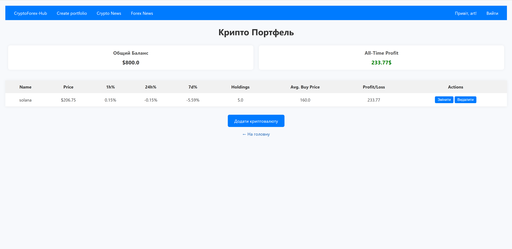

CryptoTracker
Описание проекта

CryptoTracker — это приложение для отслеживания криптовалют. Проект позволяет:

Просматривать список топ-100 криптовалют, отсортированных по рыночной капитализации.

Искать криптовалюту по символу.

Создавать собственное портфолио с возможностью отслеживать прибыль, убытки и общий баланс.

Технологии:

Python

FastAPI

SQLAlchemy (ORM)

OAuth 2.0 (авторизация)

JWT (JSON Web Token)

(HTML и CSS использовались минимально для интерфейса)

Установка и запуск

1. *Склонировать репозиторий:*

- git clone https://github.com/QertySX/CryptoTracker1.0.git

2. *Создать виртуальное окружение и установить зависимости:*

- python -m venv venv
- source venv/bin/activate  # для Linux/Mac
- venv\Scripts\activate     # для Windows
- pip install -r requirements.txt

3. *Создать файл config.py с параметрами:*

API_KEY = 'your api key'
URL = 'https://pro-api.coinmarketcap.com/v1/cryptocurrency/listings/latest'
SECRET_KEY = 'your secret key'
ALGORITHM = "HS256"
ACCESS_TOKEN_EXPIRE = 900

4. *Запустить сервер:*

- uvicorn main:app --reload

- или через файл main.py

Example: 

**GET /home** 
Главная страница приложения:  

**GET /portfolio** 
Создание и управление портфолио:

**POST portfolio/add**
Добавление криптовалюты в портфель: 

**GET /login**
Авторизация: 

**GET /register**
Регистрация: 
